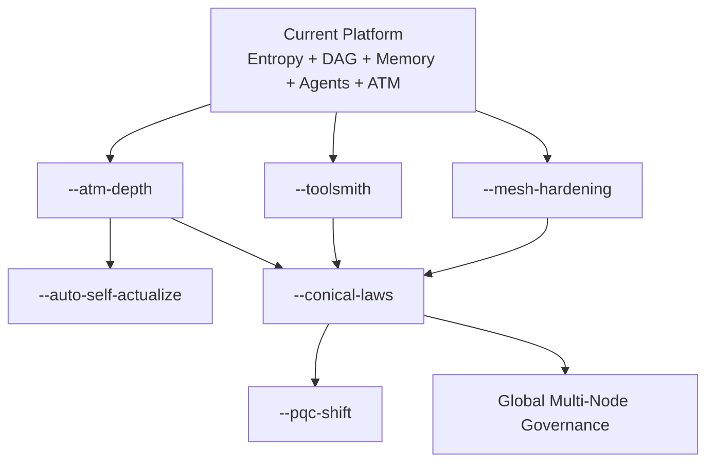

# Andyria

Edge-first hybrid intelligence platform that fuses LLM reasoning, symbolic planning,
signed entropy beacons, and an append-only cryptographic event DAG into one runtime.

## Mission

Andyria provides an auditable cognition loop from prompt to response:

1. Plan tasks from input.
2. Route tasks across language, symbolic, and tool execution paths.
3. Verify output quality and policy constraints.
4. Commit all critical state transitions into signed events.
5. Anchor every event chain to physical entropy beacons.

This enables local-first intelligence that can scale to a mesh while preserving deterministic verification.

## Current State (May 2026)

### Completed foundation

- Entropy collectors and health checks (RCT + APT) are implemented.
- Signed `EntropyBeacon` flow is implemented and integrated in event lifecycle.
- Ed25519 node identity and event signing are active.
- Event DAG store (NDJSON + index) is active.
- Content-addressed memory is active.
- Rule-based planning and safe symbolic math are active.
- Model router fallback chain (symbolic -> local model -> Ollama -> stub) is active.
- FastAPI API, CLI, and static UI are active.
- Docker dual-node mesh setup is active (`7700` + `7701`).

### Completed control-plane and UX expansion

- Agent registry with create/update/clone/retire lifecycle is implemented.
- Tab projection system (open/update/close) is implemented.
- Tool registry and tool dispatch lifecycle events are implemented.
- Chain registry and chain executor lifecycle events are implemented.
- Control-plane event stream with filters is implemented.
- ATM (Automated Thought Machine) is implemented:
  - Iterative think loop (generate -> critique -> revise).
  - Reflection pass integrated into every eligible infer response.
  - ATM event emission (`atm_started`, `atm_step`, `atm_complete`, reflection events).
- UI ATM panel and reflection badge are implemented.

### Completed runtime developer experience

- Dev overlay stack with hot-reload is implemented (`docker-compose.dev.yml`).
- Browser IDE via code-server is integrated on `:8080`.
- Unique per-agent runtime IDE workspace is implemented:
  - `GET /v1/agents/{agent_id}/dev` returns agent-specific workspace and URL.
  - UI exposes per-agent `IDE` button to open that unique workspace.

### Validation status

- Python test suite: `77 passed`.
- Dev stack services: running with API, peer, and code-server.

## System Architecture

```text
Request
  -> Coordinator
      -> Planner
          -> Router
              -> Language backend
              -> Symbolic solver
              -> Tool registry
      -> Verifier
      -> ATM reflection pass
      -> Signed Event DAG
      -> Content-addressed Memory
      -> Response
```

## Entropy Design Invariant

Raw physical entropy (jitter, thermal, `/dev/hwrng`, OS sources, system stats)
is mixed and whitened into a signed beacon. Event hashes include the beacon ID,
not the raw bytes. This preserves deterministic verification across peers while
anchoring state transitions to physical-world entropy.

## Quick Start

### Local (Python)

```bash
make setup
python -m andyria ask "What is 42 * 7?"
```

### Serve with local model config

```bash
pip install "andyria[llm]"
python -m andyria serve --config deploy/raspberry-pi/config.yaml
```

### Docker standard runtime

```bash
docker compose up -d --build
curl -X POST http://localhost:7700/v1/infer \
  -H "Content-Type: application/json" \
  -d '{"input":"Explain entropy in one sentence."}'
```

### Docker dev runtime (hot reload + browser IDE)

```bash
make dev
```

- App UI: `http://localhost:7700/`
- API docs: `http://localhost:7700/docs`
- Browser IDE (code-server): `http://localhost:8080`

## Illustrated Roadmap

### Program tracks

The roadmap is organized into execution tracks. Names prefixed with `--` are
intentional operator modes that can evolve into explicit CLI/runtime toggles.

- `--mesh-hardening`: causal sync, peer trust, deterministic merge behavior.
- `--toolsmith`: richer tool protocol, stronger isolation, replay-safe execution.
- `--atm-depth`: deeper multi-pass thought/reflection, calibrated confidence.
- `--auto-self-actualize`: bounded self-improvement loop with policy gates and auditability.
- `--conical-laws`: invariant framework for convergence, causality, safety boundaries, and governance.
- `--observability`: metrics, tracing, event graph introspection.
- `--pqc-shift`: dual-signature migration to post-quantum cryptography.

### Timeline view

```text
Now (v0.x) ---------------------------------------------------------------> Future

[Done]
  Entropy + signed beacons + event DAG + memory
  Agent/Tab/Tool/Chain control plane
  ATM think/reflect + UI integration
  Dev runtime + per-agent IDE workspaces

[Near]
  --mesh-hardening
    - Verified peer identity exchange
    - Delta sync and reconciliation metrics
    - Causal gap detection and recovery

  --toolsmith
    - Structured tool schemas and validation contracts
    - Sandboxed execution profiles
    - Deterministic tool replay mode

[Mid]
  --atm-depth
    - Reflection memory feedback loops
    - Failure mode taxonomy and correction prompts
    - Confidence calibration from historical outcomes

  --auto-self-actualize
    - Proposal -> verify -> apply loop
    - Strict policy gate before mutation
    - Signed self-change events and rollback points

[Strategic]
  --conical-laws
    - Formal invariant set for system evolution:
      C1 Causality preservation
      C2 Verifiability preservation
      C3 Safety bounded autonomy
      C4 Convergence under partial sync
      C5 Human override supremacy

  --pqc-shift
    - Ed25519 + ML-DSA dual-sign window
    - Capability signaling in node identity
    - Controlled deprecation migration plan
```

### Mermaid roadmap map



## Conical Laws (Proposed)

`--conical-laws` codifies non-negotiable constraints for all autonomous evolution:

- **Law 1: Causal Integrity**
  All state transitions must preserve parent linkage in the DAG.
- **Law 2: Cryptographic Explainability**
  Every mutation must remain provable via signed events and beacon anchors.
- **Law 3: Bounded Autonomy**
  Autonomous actions require explicit policy envelope and kill-switch compatibility.
- **Law 4: Reversible Progress**
  Major self-modifications require rollback checkpoints.
- **Law 5: Human Supremacy Channel**
  Human operator directives override autonomous loops.

## Requirements

- Python 3.11+
- Rust 1.75+
- Docker + Compose (recommended for mesh/dev workflows)
- 512 MB RAM minimum for edge profile

## Deployment Classes

| Class | Hardware | Model tier | RAM budget |
|---|---|---|---|
| Edge | Raspberry Pi / SBC | tiny < 1B | 512 MB |
| Server | Laptop / workstation | small 1-3B | 4 GB |
| Cluster | Multi-node / HPC | medium 3B+ | 16 GB |

## Non-Goals (v1)

- Training frontier-scale models
- Unbounded autonomous agency without policy constraints
- Proof-of-work blockchain consensus
- On-chain full conversation storage

## License

Apache 2.0

Andyria is intended to be freely usable worldwide under the Apache-2.0 terms.
